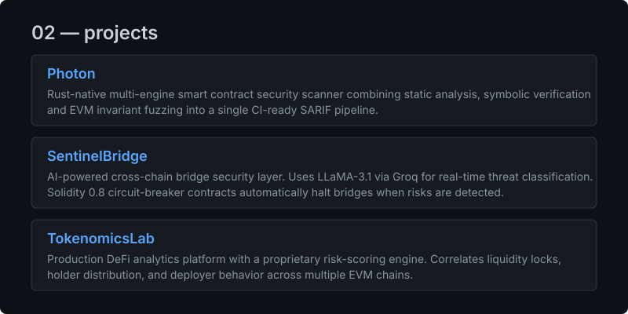
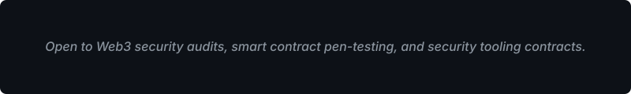

<picture>
  
</picture>

<a href="mailto:nayanjoshymaniyathjoshy@gmail.com"><picture><source media="(prefers-color-scheme: dark)" srcset="https://img.shields.io/badge/EMAIL-0d1117?style=flat-square&logo=gmail&logoColor=EA4335"/></picture></a>
<a href="https://livingsarcophagus.tech"><picture><source media="(prefers-color-scheme: dark)" srcset="https://img.shields.io/badge/WEBSITE-0d1117?style=flat-square&logo=firefox&logoColor=FF7139"/></picture></a>
<a href="https://github.com/lvingsarcophagus"><picture><source media="(prefers-color-scheme: dark)" srcset="https://img.shields.io/badge/GITHUB-0d1117?style=flat-square&logo=github&logoColor=ffffff"/></picture></a>

<picture>
  
</picture>

<picture>
  
</picture>

<picture>
  
</picture>

<picture>
  
</picture>
<picture>
  
</picture>

<picture>
  
</picture>

<picture>
  
</picture>

<picture>
  
</picture>
